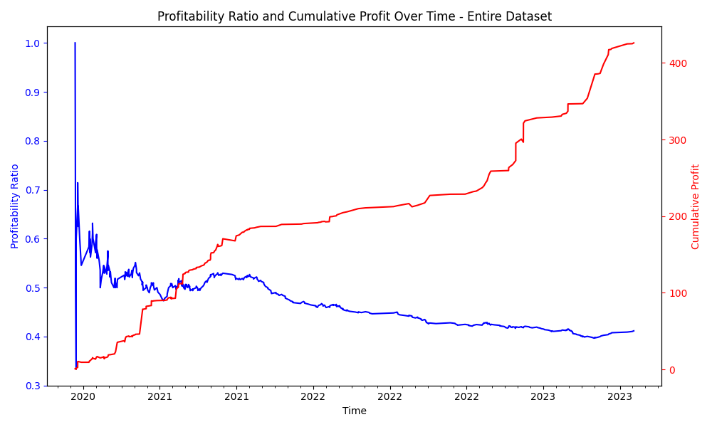

# Trade Oracle Project 🔮

   12/5/2023: *Note, the current version on the main branch isn't the model that has the 76.72% accuracy and includes the 181 days of daily price data. Please go to the historical commits and download the one labeled 'Accuracy @ 76.62%' to run the depreciated model. Please wait for the updated model.*

Oracle is a machine learning model designed to predict the profitability of trades made by BlackBoxStocks member Maria. Leveraging historical order entry and exit data from the past three years provided by Maria, this model aims to forecast the success of her trades.

## Dataset Sample

The dataset contains the following fields:

- `order_execution_datetime`
- `trader`
- `direction`
- `ticker`
- `expiration`
- `contract_details`
- `contract_price`
- `timeframe`
- `comment`
- `success`

## Project Overview

Initially, the model utilized historical 90-day time series price data for each order ticker. However, the accuracy fell short, prompting a shift to generating features based on indicators and patterns. The current accuracy stands at 76.62% using 181 days of historical price data combined with order details, with a mean cross-validation accuracy of 74%.

## In-progress Implementations

As of 12/5/2023, The ongoing enhancements include:

- Incorporating price differences to long-term/short-term resistances/supports using Fibonacci
- Analyzing price variance with moving averages
- Integration of sentiment analysis scores on the stock
- Inclusion of various index prices for comprehensive analysis

These enhancements will be released by 12/20/2023

## Approach to Trading

Maria's strategy's edge is options flow. Shas interpreted the flow with her 10+ years of trading experience. This approach entails analyzing the options flow, which represents the orders of options traded at different strike prices and expiration dates. By following the lead of large institutions trading these options, Maria aims to make informed decisions leveraging their position entries.

Oracle's dataset stems from my 2 years of experience trading with technical analysis and options flow as a member of BlackBoxStocks, coupled with a newfound understanding of machine learning acquired at university. The convergence of practical trading knowledge and academic insights has inspired the application of machine learning techniques to enhance trading decisions.

## Statistics

## How to Use

To replicate the model:

1. **Dataset**: Ensure you possess the historical order details and price data.
2. **Python Environment**: Set up a Python environment with essential libraries like Pandas, XGBoost, Matplotlib, and Seaborn.
3. **Run the Code**: Utilize the provided code snippet to load the dataset, preprocess features, and train the XGBoost classifier.

   12/5/2023: *Again, note that the current version on the main branch isn't the model that has the 76.72% accuracy and includes the 181 days of daily price data. Please go to the historical commits and download the one labeled 'Accuracy @ 76.62%' Thank you.*

## Contributions and Future Work

Contributions, suggestions, and enhancements to improve model accuracy and efficiency are encouraged. Future iterations may involve:

- Refining feature engineering techniques
- Incorporating additional technical indicators
- Optimizing hyperparameters for superior performance

Feel free to reach out for collaboration or improvements to Oracle!
