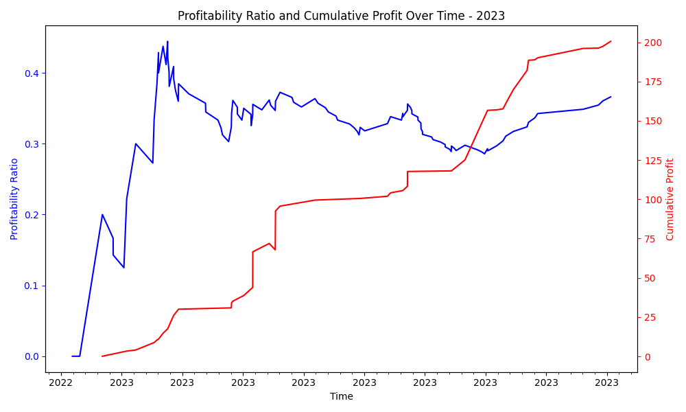

# Trade Oracle Project 🔮

**Updated Model Information (12/6/2023):**
The main branch now incorporates a Random Forest classifier achieving an 80.49% accuracy and 58.33% recall. More updates coming :)

Oracle is a machine learning model tailored to predict the profitability of trades executed by BlackBoxStocks member Maria. Utilizing historical order entry and exit data over the past three years provided by Maria, this model aims to forecast the success of her trades.

## Dataset Sample

The dataset comprises various fields:

- `order_execution_datetime`
- `trader`
- `direction`
- `ticker`
- `expiration`
- `contract_details`
- `contract_price`
- `timeframe`
- `comment`
- `success`

## Project Overview

Initially, the model relied on historical 90-day time series price data for each order ticker. However, the accuracy fell short, leading to a shift in strategy towards generating features based on indicators and patterns. The current model achieves 80.49% accuracy by leveraging historical stock indicator data combined with order details.

## In-progress Implementations

As of 12/6/2023, ongoing enhancements include:

- Adding different features
- Testing model with live trades

## Approach to Trading

Maria's strategy revolves around options flow analysis, leveraging her 10+ years of trading experience, including her tenure at TD Ameritrade. Her approach involves analyzing options flow, representing orders of options traded at varying strike prices and expiration dates. By following the lead of large institutions trading these options, Maria aims to make informed decisions based on their position entries.

Oracle's dataset amalgamates 2 years of practical trading experience in technical analysis and options flow as a BlackBoxStocks member, coupled with academic insights gained through machine learning studies at university. This convergence aims to apply machine learning techniques to enhance trading decisions.

## Statistics

## Performance of model

Cross-Validation Scores:
The cross-validation scores are computed using k-fold cross-validation (with k=6 in this case). These scores are a measure of how well the model generalizes to unseen data. The scores range from 0.54 to 0.74. The mean cross-validation accuracy is 68.02%, indicating the average accuracy of the model across different folds of the data.

Accuracy:
The overall accuracy of the model on the test set is 80.49%. This metric represents the proportion of correctly predicted instances (both positive and negative) out of the total instances.

Recall:
The recall for the positive class (class 1) is 58.33%. It signifies the proportion of actual positive instances that were correctly predicted by the model. In this context, it means that the model identified 58.33% of the actual positive cases.

Precision:
The precision for the positive class is 70.00%. Precision represents the proportion of correctly predicted positive instances out of all instances predicted as positive by the model. In this case, when the model predicts a positive outcome, it is correct 70.00% of the time.

Confusion Matrix:
The confusion matrix visualizes the model's performance in terms of true positive, true negative, false positive, and false negative predictions:

[[26  3]
 [ 5  7]]

True negatives (top-left): 26 instances correctly predicted as negative.
False negatives (bottom-left): 5 instances incorrectly predicted as negative.
True positives (bottom-right): 7 instances correctly predicted as positive.
False positives (top-right): 3 instances incorrectly predicted as positive.

## How to Use

To replicate the model:

1. **Dataset**: Ensure you possess historical order details and price data.
2. **Python Environment**: Set up a Python environment with essential libraries like Pandas, XGBoost, Matplotlib, and Seaborn.
3. **Run the Code**: Utilize the provided code snippet to load the dataset, preprocess features, and train the Random Forest classifier.

## Contributions and Future Work

Contributions, suggestions, and enhancements to improve model accuracy and efficiency are welcomed. Future iterations may involve:

- Refining feature engineering techniques
- Incorporating additional technical indicators
- Optimizing hyperparameters for superior performance

Feel free to reach out for collaboration or improvements to Oracle!
